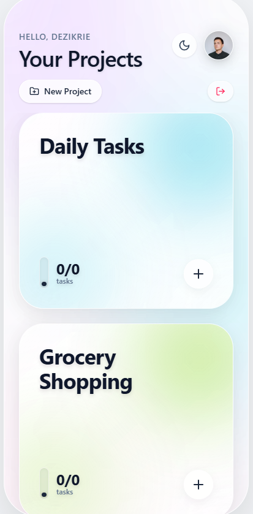

# ✨ Miroo — Clear your list. Clear your mind.

A beautiful, glassmorphic to-do list app built with React and Firebase. Miroo helps you organize tasks into projects with a stunning iOS-inspired interface featuring animated backgrounds, dark/light theme support, and real-time cloud sync.

<p align="center">
  
</p>

<p align="center">
  <a href="https://miroo-todolist.vercel.app/"><strong>🌐 Live Demo</strong></a>
</p>

## 🚀 Features

- **Project-based task management** — Organize tasks into separate projects with custom theme colors
- **Real-time cloud sync** — Data stored in Firebase Firestore, accessible from anywhere
- **Dark & Light mode** — Beautiful glassmorphic UI in both themes
- **Animated backgrounds** — Smooth blob animations for a premium feel
- **Profile customization** — Custom nicknames and avatar uploads
- **iOS-inspired design** — Rounded cards, smooth transitions, and gesture-friendly layout
- **Progress tracking** — Visual progress bars for each project

## 🛠️ Tech Stack

| Technology | Purpose |
|---|---|
| **React 19** | UI Framework |
| **Vite** | Build tool & dev server |
| **Tailwind CSS v4** | Utility-first styling |
| **Firebase** | Auth & Firestore database |
| **Lucide React** | Icon library |

## 📦 Getting Started

### Prerequisites

- Node.js 18+
- A Firebase project with Firestore and Anonymous Auth enabled

### Installation

```bash
# Clone the repository
git clone https://github.com/painfulbykisses/miroo-todolist.git
cd miroo-todolist

# Install dependencies
npm install

# Start development server
npm run dev
```

### Firebase Setup

This app requires Firebase configuration. You need to provide your Firebase config through environment variables:

- `__firebase_config` — Your Firebase project configuration JSON
- `__app_id` — Your Firebase app ID
- `__initial_auth_token` — (Optional) Custom auth token

## 📄 License

MIT
